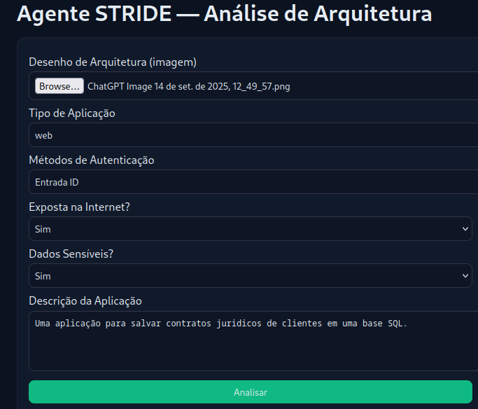
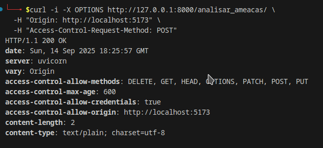
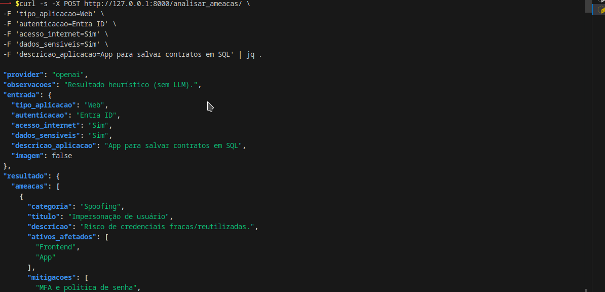
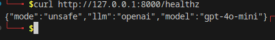

# Agente STRIDE — Análise de Arquiteturas (FastAPI + Cytoscape)

Assistente que analisa arquiteturas (com ou sem imagem do diagrama) e gera:

- Lista de ameaças STRIDE com mitigações sugeridas.

- Grafo interativo (Cytoscape) ligando Ativos ⇄ Ameaças ⇄ Categorias.

# ✨ Funcionalidades

- Entrada textual (tipo de app, autenticação, dados sensíveis etc.)

- Entrada de imagem (diagrama/arquitetura)

- Modo Heurístico (sem LLM) — funciona offline.

- Modo LLM (OpenAI ou Azure OpenAI) — raciocínio mais rico.

- Frontend estático (HTML/JS) com Cytoscape.

# 🧱 Stack

- FastAPI (backend, /analisar_ameacas/, /healthz)

- Cytoscape.js (grafo)

- HTML + fetch (frontend simples)

# ⚙️ Requisitos

- Python 3.10+

- Navegador recente (Firefox/Chrome)

- (Opcional) Chave OpenAI ou Azure OpenAI para modo LLM

# 🚀 Como rodar (dev)

Backend

    cd agent-api
    python -m venv .venv && source .venv/bin/activate
    pip install -r requirements.txt

    cp .env.example .env
    
    # ajuste CORS do front
    echo 'ALLOWED_ORIGINS=http://localhost:5173,http://127.0.0.1:5173' >> .env

    uvicorn main:app --reload --port 8000

Frontend

    cd frontend
    python -m http.server 5173
    # abra http://localhost:5173

Verificação

    curl http://127.0.0.1:8000/healthz
    # esperado (modo heurístico): {"mode":"unsafe","llm":"none","model":null}

# 🤖 (Opcional) Ativar LLM

## OpenAI

Adicione no agent-api/.env:

    OPENAI_API_KEY=sk-xxxx
    OPENAI_MODEL=gpt-4o-mini

Reinicie o backend e confira:

    curl http://127.0.0.1:8000/healthz
    # {"mode":"unsafe","llm":"openai","model":"gpt-4o-mini"}

# Azure OpenAI

    AZURE_OPENAI_API_KEY=...
    AZURE_OPENAI_ENDPOINT=https://SEU-RECURSO.openai.azure.com/
    AZURE_OPENAI_API_VERSION=2024-05-01-preview
    AZURE_OPENAI_DEPLOYMENT_NAME=gpt-4o-mini

# 📡 API
## GET /healthz

Status e provedor LLM.

    curl http://127.0.0.1:8000/healthz

## 📸 Demonstração rápida

**1) Formulário do agente (frontend)**

**2) Grafo de ameaças (Cytoscape)**

**3) CORS / Preflight OK (OPTIONS)**

**4) Teste via cURL (sem imagem, heurístico)**

**5) /healthz mostrando LLM configurado**

